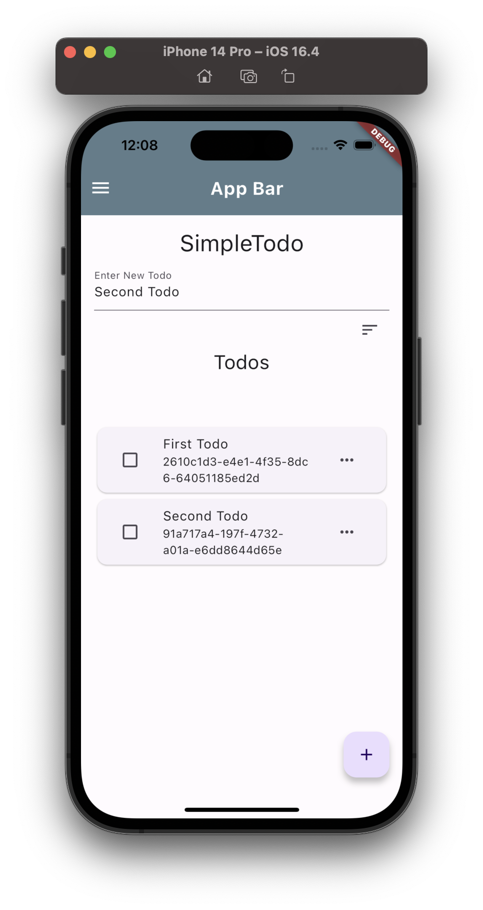
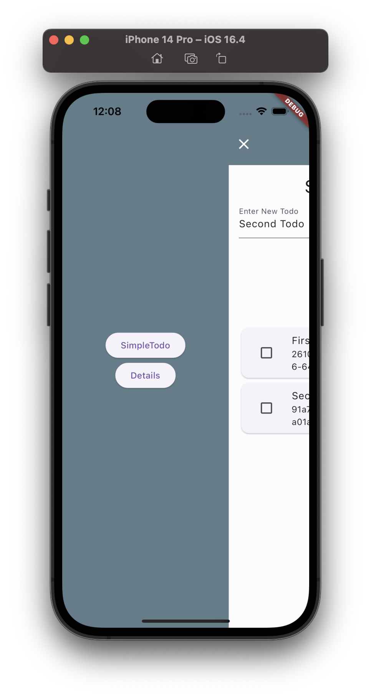
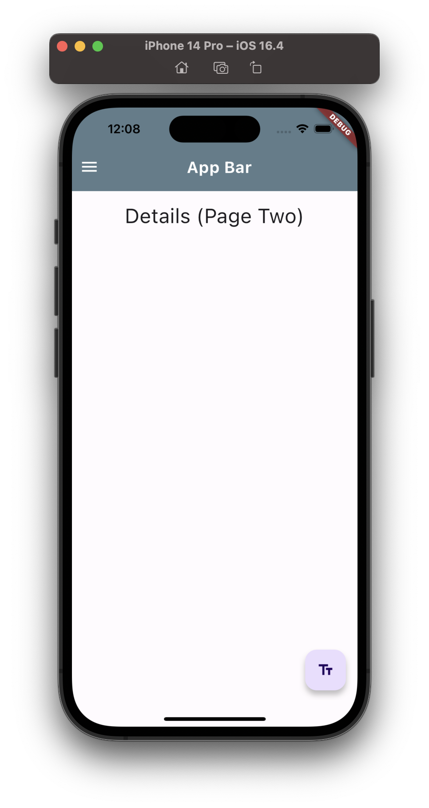

# Pragmatic Architecture using Riverpod

This repository has been created to illustrate a pragmatic architecture using Riverpod.

### Concepts and Tools Used:

- Routing
  - Navigator 2 (`go_router`)
  - Nested Navigation (Drawer + `ShellRoute`)
- State Management
  - `riverpod`
  - `flutter_hooks`
- App Architecture
  - MVVM (`models` + `repositories` + `providers` + `views`)
  - Immutable States (`freezed`)

